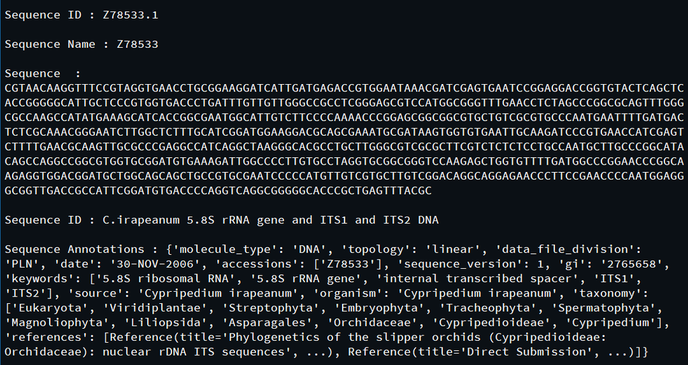
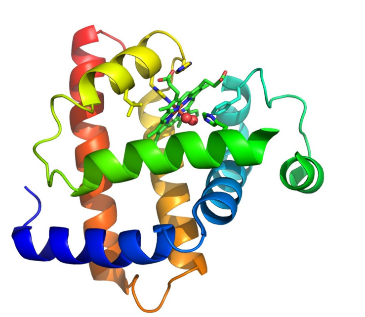

# README
  
De super coole website
Versie 2
11-03-2025
  
Een website die willekeurige opgegeven DNA codons van de gebruiker kan omzetten in een
aminozuursequentie, die vervolgens weer kan worden gekoppeld aan het bijpassende eiwit.
  
Hierbij wordt gebruik gemaakt van **BioPython** en **BLAST**.  
**Biopython** is een verzameling van beschikbare Python modules voor computationele moleculaire biologie.  
**BLAST** staat voor Basic Local Alignment Search Tool. Het vindt regio's van gelijkenis tussen biologische sequenties.
Onderstaand is een voorbeeld weergegeven van de data over een sequentie die BioPython en BLAST terug kunnen geven.  
  

  
Dit eiwit kan vervolgens door middel van **UCSF ChimeraX** worden gevisualiseerd in een 3D-weergave van de tertiaire- en mogelijk de  quarternaire structuur (afhankelijk van de hoeveelheid eiwitten).  

**UCSF Chimera** is een programma voor de interactieve visualisatie en analyse van moleculaire structuren en gerelateerde gegevens.  
Dit is een voorbeeld van een mogelijke visualisatie:  
  

  
Aangezien een interactieve werking lastig is om goed te laten werken op de website,  
proberen wij een animatie weer te geven van het eiwit, zodat alle eigenschappen van het eiwit zichtbaar zijn.  
Net als in het bovenstaande voorbeeld, wordt de visualisatie van een eiwit op onze website gegarandeerd getoond als een afbeelding  
van de 3D-structuur.  
  
De koppeling aan het eiwit en de visualisatie ervan zijn wel afhankelijk van de aanwezigheid van de data over het opgegeven  
eiwit in diverse databases (PDB, Uniprot, etc.).  
Als er nog geen 3D-structuur van dit eiwit in de databases bestaat en/of als het eiwit nog niet goed onderzocht is,  
kan het zijn dat de koppeling en visualisatie niet mogelijk is.  
  
De website wordt gerunned via een Python file die gebruik maakt van **Flask**.  
**Flask** is een verzameling libraries en een Python-module waarmee eenvoudig een webapplicatie ontwikkeld kan worden.    
  
## Linux installatie
  
Maak een map aan in de Linux terminal door gebruik te maken van de volgende invoer:
`mkdir /homes/jouwgebruikersnaam/locatie/mapnaam`  

Vervang hierbij:
*jouwgebruikersnaam* door jouw daadwerkelijke gebruikersnaam op het systeem.
*locatie* door de map waarin je een nieuwe map wilt aanmaken (of laat dit weg als je de map direct in je home-map wilt plaatsen).
*mapnaam* door de naam van de nieuwe map die je wilt maken. 
  
Ga naar de volgende website voor de tool: https://www.cgl.ucsf.edu/chimera/download.html
  
Klik op deze website op de knop “Download” aan de linkerkant van het scherm.
  
Klik onder "Current Production Releases" op de link: `chimera-1.19-linux_x86_64.bin`
  
Deze link download het installatieprogramma van de nieuwste versie van ChimeraX die beschikbaar op Linux.
  
Klik vervolgens op “Accept” onderaan het scherm, de tool begint nu met downloaden.
  
Volg nu de volgende stappen in de terminal om naar de "Downloads" folder te gaan:  
Om terug te gaan naar "homes" folder: `cd ~`
Om naar de "Downloads" folder te gaan: `cd Downloads`
Check door middel van de volgende input of het installatieprogramma in de map staat: `ls`
  
Nu moet je jezelf toegang geven aan de tool, dit doe je door dit in de terminal te zetten:
`chmod +x chimera-1.18-linux_x86_64.bin`
  
Met `ls –l` zie je nu dat "chimera-1.18-linux_x86_64.bin" groen is geworden.
  
Voer nu `chimera-1.18-linux_x86_64.bin` in in de terminal, nu begint de tool te downloaden.

Tijdens het downloaden moet je verschillende keren op enter klikken. Het kan even
duren voordat dit proces klaar is. Je kan als je wilt meteen de locatie veranderen waar je
de tool wilt installeren, bijvoorbeeld naar je "Downloads" folder:

De tool is nu geïnstalleerd in je "Downloads" folder met de naam: "chimera_install_0kntNt",
om deze te verplaatsen naar de map die je hebt gemaakt voer je dit in de terminal in (zorg ervoor dat je in
je "Downloads" folder zit): `mv chimera_install_0kntNt /homes/jouwnaam/locatie/mapnaam`

Als je nu met cd naar deze locatie gaat en ls invoert zie je de tool in deze map.

Voer nu dit in in de terminal: `/homes/jouwgebruikersnaam/locatie/mapnaam/chimera_install_0kntNt/chimera.bin installer`

Je moet hier weer een paar keer de y voor yes invullen

Voer nu nog een keer dit uit in de terminal: `/homes/jouwgebruikersnaam/locatie/mapnaam/chimera_install_0kntNt/chimera.bin installer`

Als je nu naar `chimera_install_0kntNt` gaat in de terminal zie je verschillende dingen in het mapje. Cd hier naar bin

Om de tool op te starten voer je nu chimera in de terminal, de tool start nu op

Het hele pad naar de tool is dus:
`/homes /jouwnaam/locatie/mapnaam/chimera_install_0kntNt/bin/chimera`

## Contactgegevens
  
Fleur Luten - f.luten@st.hanze.nl
Isa Bos - ir.bos.2@st.hanze.nl
Naomy Schuppers - n.schuppers@st.hanze.nl
Ype Vos - y.de.vos@st.hanze.nl

Referentie, Licenties

# Website
