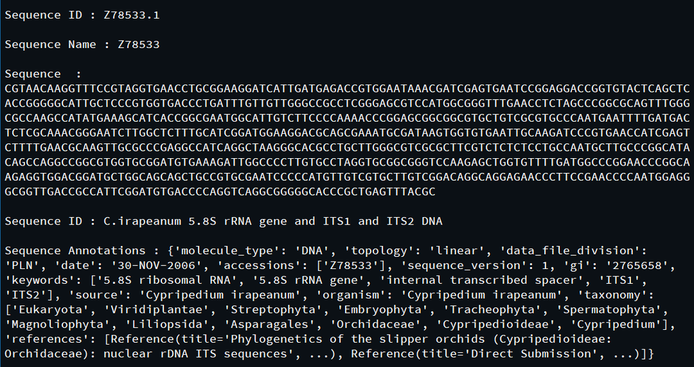
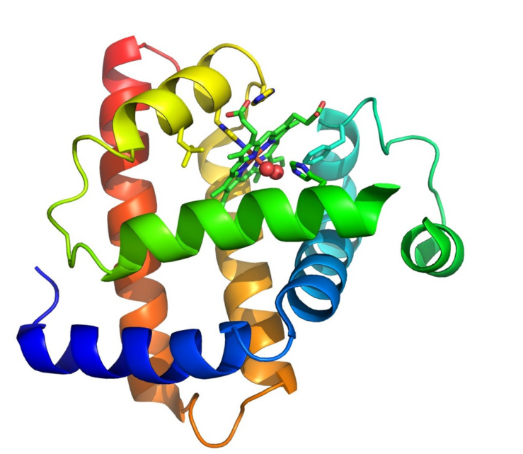

# README
  
De super coole website
Versie 2
11-03-2025
  
Een website die willekeurige opgegeven DNA codons van de gebruiker kan omzetten in een
aminozuursequentie, die vervolgens weer kan worden gekoppeld aan het bijpassende eiwit.
  
Hierbij wordt gebruik gemaakt van **BioPython**,**BLAST** en **UCSF ChimeraX**.  
**Biopython** is een verzameling van beschikbare Python modules voor computationele moleculaire biologie.  
**BLAST** staat voor Basic Local Alignment Search Tool. Het vindt regio's van gelijkenis tussen biologische sequenties.  
**UCSF Chimera** is een programma voor de interactieve visualisatie en analyse van moleculaire structuren en gerelateerde gegevens.  
  
Onderstaand is een voorbeeld weergegeven van de data over een sequentie die BioPython en BLAST terug kunnen geven.  
  

  
Dit eiwit kan vervolgens door middel van **UCSF ChimeraX** worden gevisualiseerd in een 3D-weergave van de tertiaire- en mogelijk de  quarternaire structuur (afhankelijk van de hoeveelheid eiwitten).  
  
Dit is een voorbeeld van een mogelijke visualisatie:  
  

  
Aangezien een interactieve werking lastig is om goed te laten werken op de website,  
proberen wij een animatie weer te geven van het eiwit, zodat alle eigenschappen van het eiwit zichtbaar zijn.  
Net als in het bovenstaande voorbeeld, wordt de visualisatie van een eiwit op onze website gegarandeerd getoond als een afbeelding  
van de 3D-structuur.  
  
De koppeling aan het eiwit en de visualisatie ervan zijn wel afhankelijk van de aanwezigheid van de data over het opgegeven  
eiwit in diverse databases (PDB, Uniprot, etc.).  
Als er nog geen 3D-structuur van dit eiwit in de databases bestaat en/of als het eiwit nog niet goed onderzocht is,  
kan het zijn dat de koppeling en visualisatie niet mogelijk is.  
  
De website wordt gerunned via een Python file die gebruik maakt van **Flask**.  
**Flask** is een verzameling libraries en een Python-module waarmee eenvoudig een webapplicatie ontwikkeld kan worden.    
  
## Linux installatie
  
Maak een map aan in de Linux terminal door gebruik te maken van de volgende invoer:
`cd ~`
`mkdir Documents/chimera_map`
  
Ga naar de volgende website voor de tool: https://www.cgl.ucsf.edu/chimera/download.html
  
Klik op deze website op de knop “Download” aan de linkerkant van het scherm.

Klik onder "Current Production Releases" op de link: "chimera-1.19-linux_x86_64.bin"
  
Deze link download het installatieprogramma van de nieuwste versie van Chimera die beschikbaar op Linux.
  
Klik vervolgens op “Accept” onderaan het scherm, de tool begint nu met downloaden.
  
Volg nu de volgende stappen in de terminal om naar de "Downloads" folder te gaan:  
Om naar de "Downloads" folder te gaan: `cd Downloads`  
Check door middel van de volgende input of het installatieprogramma "chimera-1.19-linux_x86_64.bin" in de map staat: `ls`
    
Nu moet je jezelf toegang geven aan de tool, dit doe je door dit in de terminal te zetten:  
`chmod +x chimera-1.19-linux_x86_64.bin`  
    
Met `ls –l` zie je nu dat "chimera-1.18-linux_x86_64.bin" groen is geworden.  
    
Voer nu `chimera-1.19-linux_x86_64.bin` in in de terminal, nu begint de tool te downloaden.  
  
De terminal geeft vervolgens "Enter install location" weer.  
Er wordt dan automatisch ingevuld dat Chimera in de "Downloads" folder wordt gedownload.  
Verwijder deze tekst en vul in de terminal in:`/Documents/chimera_map`  
  
De terminal geeft nu "Install desktop menu and icon?" weer en vult automatisch "yes" in, klik hier op `enter`.  
Vervolgens geeft het terug: "Install symbolic link to chimera executable for command line use in which directory?".  
Klik ook hier de `enter` toets in.  
  
De installatie is hierna klaar en er wordt gevraagd om op `return` te klikken.  
  
Gebruik nu `cd ~` en daarna `cd Documents/chimera_map` om te checken of Chimera erin staat.  
  
Het hele pad vanaf de home map naar de tool is dus:
`Documents/chimera_map/bin/chimera`  

## Contactgegevens
  
Fleur Luten - f.luten@st.hanze.nl
Isa Bos - ir.bos.2@st.hanze.nl
Naomy Schuppers - n.schuppers@st.hanze.nl
Ype Vos - y.de.vos@st.hanze.nl

Referentie, Licenties

# Website
